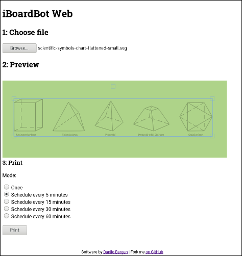

# iBoardBot Web

[![CircleCI][circle-ci-badge]][circle-ci]

An unofficial iBoardBot client that does not require you to use an
unauthenticated, unencrypted cloud solution :)

Instead, it communicates with the iBoardBot through serial, for example from a
Raspberry Pi.

This project requires the iBoardBot to load [my fork of the
firmware](https://github.com/dbrgn/iBoardbot).

This is what it looks like in the browser:

## Modes

The program has two modes: Regular mode or headless mode.

In regular mode, you can preview and print directly through the web
interface.

In headless mode, the printer will load SVGs from a directory and print them
one by one in a specified interval. This is good for unattended
installations.

## Building

Build debug build:

    $ cargo build

Build release build for Raspberry Pi:

    $ cargo build --release --target arm-unknown-linux-gnueabihf

## Starting

This project currently requires Rust 1.31+. The easiest way to get that is
through [rustup](https://rustup.rs/).

To start the server:

    $ cargo run -c config.json

The `-c` argument is optional, it defaults to `config.json`.

The configfile needs to look like this:

    {
        "listen": "127.0.0.1:8080",
        "device": "/dev/ttyACM0",
        "svg_dir": "/path/to/svgdir",
        "static_dir": "/srv/www/static",
        "interval_seconds": 900,
        "time_limits": {
            "start_time": [6, 0],
            "end_time": [0, 30]
        }
    }

...or for preview-only:

    {
        "listen": "127.0.0.1:8080",
        "static_dir": "/srv/www/static"
    }

(Note: The `static_dir`, `listen` and `time_limits` keys are optional.)

If you use the original iBoardBot Arduino via USB, then the `device` will
probably be `/dev/ttyACM0`. The `svg_dir` points to the directory where SVG
files are stored for printing. And the `interval_seconds` value will determine
in which interval to start draws.

Now the server is running on `http://127.0.0.1:8000/`.

## Fabric.js

Fabric (used for the preview in the frontend) was built with the following options:

    $ node build.js modules=interaction,text,no-svg-export

## License

Licensed under either of

 * Apache License, Version 2.0 ([LICENSE-APACHE](LICENSE-APACHE) or
   http://www.apache.org/licenses/LICENSE-2.0)
 * MIT license ([LICENSE-MIT](LICENSE-MIT) or
   http://opensource.org/licenses/MIT) at your option.

[circle-ci]: https://circleci.com/gh/dbrgn/iboardbot-web/tree/master
[circle-ci-badge]: https://circleci.com/gh/dbrgn/iboardbot-web/tree/master.svg?style=shield
